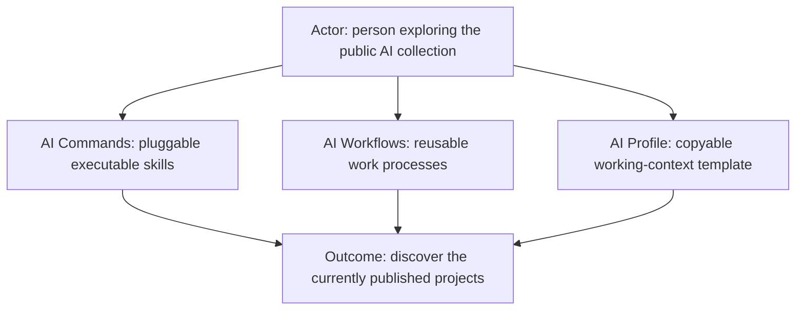
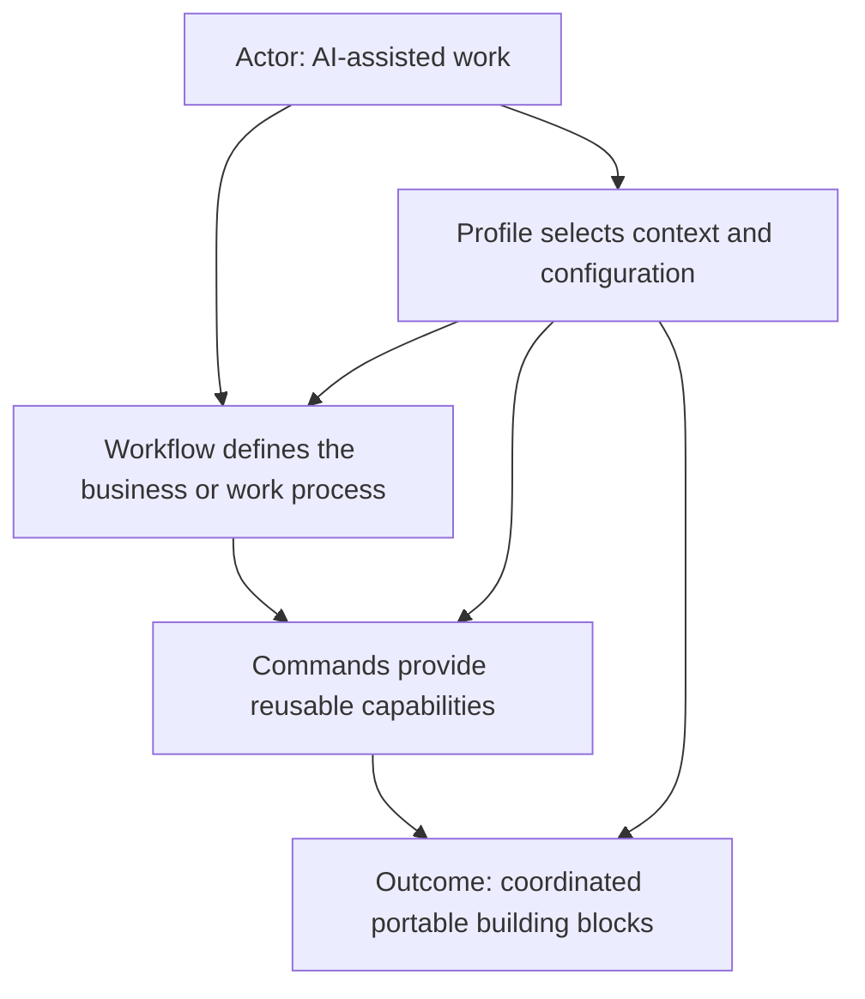
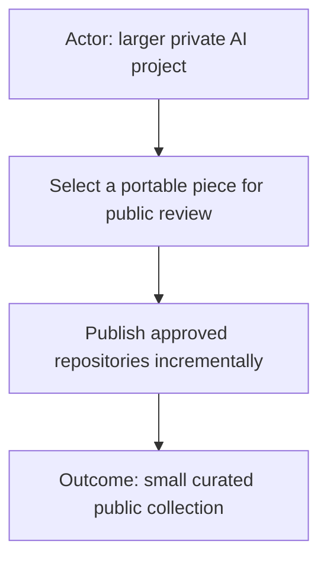

# AI

This is the umbrella repository for useful public pieces of the **AI Workflow Suite** and related AI work from Starodubtsev Consulting. The projects are kept in separate repositories so each piece can evolve and be used independently, while this repository provides a simple entry point to understand how they fit together.

The public collection currently includes **AI Commands**, **AI Workflows**, and **AI Profile**, with additional useful pieces published as they become ready. Feel free to explore, contribute, or ask questions.

This umbrella repository also contains shared AI reference material that does not belong to one specific implementation project, including **[local model and hardware benchmarks](benchmarks/local-models/README.md)**.

Public entry point for reusable AI-assisted work projects from Starodubtsev Consulting.

## AI vocabulary

A short practical vocabulary for terms used throughout these repositories. The goal is intuition first; exact implementations vary.

### Agent

An **agent** is a running AI participant given a model, context, rules and capabilities so it can pursue a goal and take actions rather than only answer one isolated prompt.

In this project, reusable agent behavior is defined in [AI Workflows](https://github.com/starodubtsevconsulting/ai-workflows). A workflow agent is a concrete realization of a reusable role inside a particular workflow.

### Roster

A **roster** is the current list of active agent instances in a team: who is present, which role each instance occupies and its runtime identity.

Think of the workflow/team definition as the organization chart and the roster as **who is actually at work right now**.

### Harness

A **harness** is the runtime around a model that turns it into a useful working agent. It usually manages the conversation/agent loop and may provide tools, files, terminal access, plugins, skills, sessions, sub-agents, computer use and other capabilities.

The model is the intelligence; the harness is much of the machinery that lets that intelligence work.

Examples we currently experiment with or reference:

| Harness | What it is | Reference |
| --- | --- | --- |
| Codex | OpenAI agent/coding environment | [OpenAI Codex](https://openai.com/codex/) |
| Claude Code | Anthropic agentic coding environment | [Claude Code](https://www.anthropic.com/claude-code) |
| Pi | Extensible agent harness / coding-agent toolkit | [earendil-works/pi](https://github.com/earendil-works/pi) |
| Hermes Agent | General-purpose extensible agent from Nous Research | [NousResearch/hermes-agent](https://github.com/NousResearch/hermes-agent) |

The list is not permanent. Harnesses can appear/disappear while the concept remains useful.

### Token

A **token** is a small piece of text that a language model reads or produces. A word may be one token or several tokens; punctuation and pieces of words can also be tokens.

Tokens are **not literally GPU time or electricity**, but for practical intuition they are a useful meter for how much model work we are asking for. More input to read and more output/reasoning to generate generally means more computation, time and money.

So when these repositories talk about keeping context small or saving tokens, think:

`less unnecessary material -> less model work -> usually less latency/cost`

Token count is an inference-time measurement. It should not be confused with the much larger compute/energy cost used to **train** a model.

### Model

A **model** is the trained neural network doing the language/reasoning work. Examples include GPT, Claude, Gemini, Qwen and many open-weight models.

The same harness may be able to use different models, and the same model may be exposed through different harnesses.

`Harness != Model`

### Training

**Training** is the expensive process that creates/updates a model by showing a neural network enormous amounts of data and repeatedly adjusting its internal parameters so it becomes better at predicting/producing useful outputs.

Training a frontier model can require large GPU clusters and enormous computation. **Running/inference** is different: it uses the already-trained parameters to answer a request.

Most work in these repositories is about using/orchestrating trained models, not training frontier models from scratch.

### Parameters: 8B, 30B, 70B...

A **parameter** is one of the learned numerical values inside a model. `8B` means roughly **8 billion parameters**; `70B` means roughly **70 billion**.

More parameters usually mean more memory/compute, but **parameter count is not a direct intelligence score**. Architecture, training data, training method, quantization and task matter enormously.

Very rough local-running intuition for dense models:

| Model class | Approx. 4-bit weight memory | Practical local hardware intuition | Very rough hardware budget* |
| --- | ---: | --- | ---: |
| ~8B | ~4–6 GB | One modest modern GPU / unified-memory machine | ~$500–$1,500 |
| ~20–35B | ~10–20 GB | Usually ~24 GB-class GPU/memory or better | ~$1,000–$3,000 |
| ~70B | ~35–45 GB | ~48 GB+ usable accelerator/unified memory is much more comfortable | ~$2,000–$6,000+ |
| 100B+ | ~50 GB+ | High-memory workstation or multiple accelerators; rapidly becomes expensive | ~$5,000–$20,000+ |

\*Order-of-magnitude USD hardware intuition only, not a buying guide. Prices vary dramatically by GPU, used/new hardware, country, speed requirements and whether CPU/unified-memory inference is acceptable. Runtime also needs memory for context/KV cache and software overhead, so model-file size alone is not enough.

Quantization stores parameters with fewer bits, making a large model fit into less memory, usually with some quality/performance trade-off.

### Model provider / AI provider

A **model provider** is the system/company/runtime that gives you access to a model.

Examples include OpenAI, Anthropic, Google, an inference hosting company, or your own local model server.

This distinction matters because:

`Agent/Harness -> Model Provider -> Model`

For example, a harness might use OpenAI today and a local Qwen endpoint tomorrow without changing the conceptual job of the agent.

In our command/workflow architecture we use the broader word **provider** similarly: a generic capability can resolve to a concrete implementation, such as logs -> Datadog or source control -> Git.

## Repositories

### [AI Commands](https://github.com/starodubtsevconsulting/ai-commands)

Pluggable executable skills that combine AI-readable Markdown contracts with optional scripts, supporting code, configuration boundaries, reports, and command-owned visual tools.

### [AI Workflows](https://github.com/starodubtsevconsulting/ai-workflows)

Reusable business and work processes that coordinate commands and define the agent roles, rules, and collaboration needed to complete a workflow.

### [AI Profile](https://github.com/starodubtsevconsulting/ai-profile)

A sanitized, copyable example of the personal or organization-specific context that activates workflows, configures commands, binds projects, and supplies non-secret policies and runtime preferences. Commands and workflows remain portable and profile-agnostic; real profiles normally stay private because they may identify internal projects, repositories, integrations, and policies.

## Current status

Only the repositories listed above are currently published as part of this collection. Additional commands, workflows, profiles, runtimes, and integrations remain outside the public collection unless they receive explicit review and, for profiles, sanitization suitable for public release.
