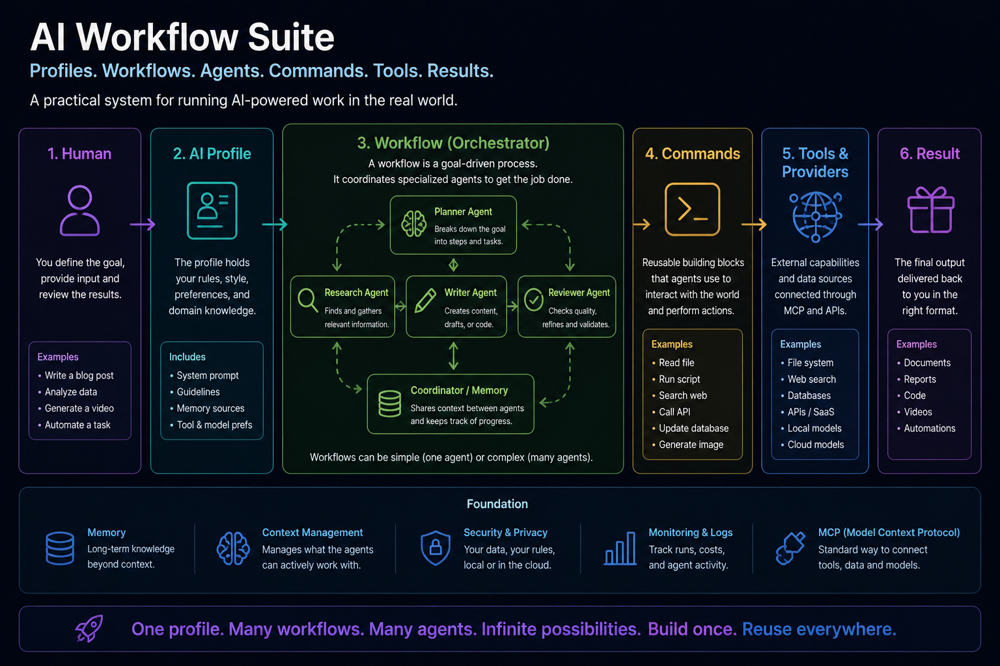
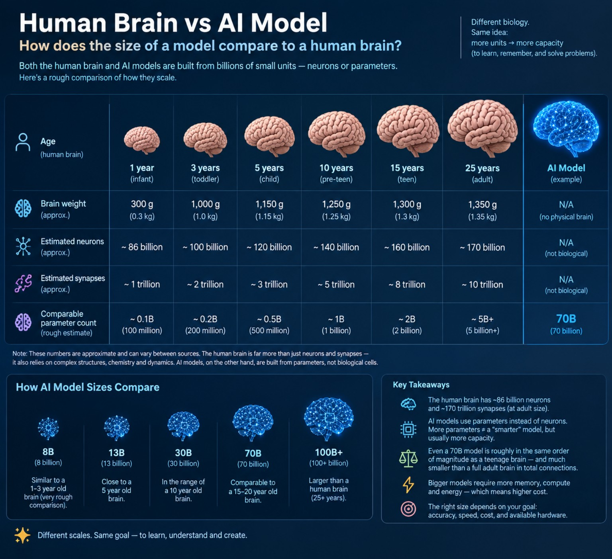

# AI

**A public window into how I am building and using AI systems in real work.**

This collection covers agents, workflows, reusable commands, profiles, local models, governance, automation and experiments. For someone exploring my work, it is a quick way to see the areas of AI engineering I am actively working with rather than just a list of technologies on a profile.

### For people who already build this stuff

**This is not another AI agent framework.** Agents, tools, workflows, MCP and many of the individual ideas here already exist in excellent systems, and that is expected.

What is public here is a deliberately selected **slice of a larger working system**: reusable patterns, architectural decisions, rules, commands, workflows, experiments, benchmarks and some of the reasoning behind them. It is the visible tip rather than the complete implementation.

**Do I actually use this? Yes.** The public repositories are derived from patterns and pieces I use in my private working environment. The private version has the additional runtime, UI, launcher integration, project-specific configuration, memory, local-model workers, integrations and other bells and whistles needed for day-to-day use.

The purpose of this repository is therefore not to claim that every building block is new. It is to make some of the work and thinking visible, provide useful pieces where they can stand on their own, and create a concrete starting point for conversations, collaboration and new opportunities.

## Public collection

The currently published pieces are **AI Commands**, **AI Workflows**, and **AI Profile**, with additional pieces published when they make sense independently and are suitable for public use.

This umbrella repository also contains shared reference material that does not belong to one implementation project, including **[local model and hardware benchmarks](benchmarks/local-models/README.md)**.

## AI Workflow Suite vocabulary

These are the main building blocks used across the public repositories. The names are intentionally simple; the links lead to the repositories where each concept is defined or demonstrated.

| Term | Simple meaning | Reference |
| --- | --- | --- |
| **Command** | A reusable executable AI capability with a defined contract, inputs and outputs. Workflows and agents can use commands without owning their implementation. | [AI Commands](https://github.com/starodubtsevconsulting/ai/tree/main/ai-commands) |
| **Workflow** | A reusable process for a kind of work. It defines the roles, rules, collaboration and capabilities needed to pursue an outcome. | [AI Workflows](https://github.com/starodubtsevconsulting/ai/tree/main/ai-workflows) |
| **Flow / route** | The path work follows inside a workflow: who talks to whom, what happens next, and where responsibility moves. It is coordination, not another executable command. | [AI Workflows — agents and communication](https://github.com/starodubtsevconsulting/ai/blob/main/ai-workflows/agents.md) |
| **Role** | A reusable behavioral contract describing responsibilities, boundaries, lifecycle and expected behavior. A role is conceptual; an agent realizes it at runtime. | [AI Workflows — common roles](https://github.com/starodubtsevconsulting/ai/tree/main/ai-workflows/_common/roles) |
| **Agent** | A runtime participant that realizes a role inside a workflow with concrete configuration, identity, capabilities and relationships to other agents. | [AI Workflows — agents](https://github.com/starodubtsevconsulting/ai/blob/main/ai-workflows/agents.md) |
| **Profile** | Personal or organization-specific configuration that activates workflows, binds projects, configures commands and supplies policies/runtime preferences. | [AI Profile](https://github.com/starodubtsevconsulting/ai-profile) |
| **Project / source** | A concrete source of work or knowledge that a workflow operates on. One workflow can work with multiple projects/sources. | [AI Profile — example](https://github.com/starodubtsevconsulting/ai-profile/tree/main/example) |
| **Provider** | A concrete implementation behind a generic capability, such as Datadog for logs, Git for source control, or a particular model provider for inference. | [AI Commands](https://github.com/starodubtsevconsulting/ai/tree/main/ai-commands) |

A useful mental model is:

`Profile -> Workflow -> Agents/Roles -> Flow -> Commands -> Providers -> Result`

## AI vocabulary

Short practical definitions for broader AI terms used throughout these repositories. The goal is intuition first; implementations vary.

| Term | Simple meaning | Practical note / reference |
| --- | --- | --- |
| **Agent** | A running AI participant with a model, context, rules and capabilities that can pursue a goal and take actions. | In this project, workflow agents realize reusable roles. See [AI Workflows](https://github.com/starodubtsevconsulting/ai/tree/main/ai-workflows). |
| **Roster** | The current list of active agent instances: who is present, their role and runtime identity. | Team definition is the organization chart; roster is **who is actually at work right now**. |
| **Harness** | Runtime machinery around a model: agent loop, sessions, tools, files, terminal, plugins, sub-agents, computer use, etc. | **Model = intelligence; harness = machinery that lets it work.** Examples below. |
| **Token** | A small piece of text a language model reads or produces. A word may be one token or several. | Not literally electricity/GPU time, but a useful meter of model work: more unnecessary tokens usually mean more compute, latency and cost. |
| **Context** | The information currently supplied to the model for this request/session: instructions, conversation, retrieved files/data, tool results, etc. | Context is the model's **current working material**. More context is not automatically better; irrelevant context can cost money and make reasoning harder. |
| **Context window** | The maximum amount of tokenized context a model can work with at once. | One of the most important practical AI limits. Understanding it helps keep agents focused, improves efficiency and avoids paying repeatedly for material the model did not need. |
| **Prompt** | An instruction or request given to the model. | A prompt is only part of the context; system rules, history, retrieved information and tool results may also be present. |
| **Tool / tool call** | A capability the model/agent can invoke to interact with something outside its own generated text. | Examples: read a file, call an API, execute a command, search, inspect a calendar. The model chooses/requests the action; the tool actually performs it. |
| **Memory** | Information preserved so it can be retrieved again beyond the immediate working context/session. | `Memory != context`. Good systems retrieve only relevant memory instead of loading everything every time. |
| **MCP (Model Context Protocol)** | A protocol for exposing tools/resources to AI applications through a common interface. | It can make integrations portable across compatible clients/harnesses instead of building a custom connection for each one. |
| **Model** | The trained neural network doing language/reasoning work, e.g. GPT, Claude, Gemini or Qwen. | `Harness != Model`. One harness can use different models. |
| **Training** | The expensive process of creating/updating a model by repeatedly adjusting its learned parameters from large amounts of data. | Different from **inference**, which runs an already-trained model to answer requests. |
| **Inference** | Running a trained model to process input and generate an answer/action. | Most work in these repositories is inference/orchestration, not frontier-model training. |
| **Parameter** | A learned numerical value inside a model. `8B` means roughly 8 billion parameters. | More parameters usually require more memory/compute, but parameter count is **not an intelligence score**. |
| **Quantization** | Storing model parameters with fewer bits so the model needs less memory. | Makes large local models practical, usually with some quality/performance trade-off. |
| **Model / AI provider** | The system/company/runtime that provides access to a model. | OpenAI, Anthropic, Google, hosted inference, or your own local server. `Agent/Harness -> Provider -> Model`. |
| **Provider** | A concrete implementation behind a generic capability. | Used broadly in this architecture: `logs -> Datadog`, `source control -> Git`, etc. |

The practical relationship between **tokens, context and context window** is worth remembering: every useful piece of context can help the model, but every unnecessary piece also consumes working space and often compute/money. Context management is therefore part of using AI efficiently, not just a technical implementation detail.

### Common harnesses

| Harness | What it is | Reference |
| --- | --- | --- |
| Codex | OpenAI agent/coding environment | [OpenAI Codex](https://openai.com/codex/) |
| Claude Code | Anthropic agentic coding environment | [Claude Code](https://www.anthropic.com/claude-code) |
| Pi | Extensible agent harness / coding-agent toolkit | [earendil-works/pi](https://github.com/earendil-works/pi) |
| Hermes Agent | General-purpose extensible agent from Nous Research | [NousResearch/hermes-agent](https://github.com/NousResearch/hermes-agent) |

Harnesses may appear/disappear; the abstraction remains useful.

### Model size: rough local-running intuition

| Model class | Approx. 4-bit weight memory | Practical local hardware intuition | Very rough hardware budget* |
| --- | ---: | --- | ---: |
| ~8B | ~4–6 GB | One modest modern GPU / unified-memory machine | ~$500–$1,500 |
| ~20–35B | ~10–20 GB | Usually ~24 GB-class GPU/memory or better | ~$1,000–$3,000 |
| ~70B | ~35–45 GB | ~48 GB+ usable accelerator/unified memory is much more comfortable | ~$2,000–$6,000+ |
| 100B+ | ~50 GB+ | High-memory workstation or multiple accelerators; rapidly becomes expensive | ~$5,000–$20,000+ |

\*Order-of-magnitude USD hardware intuition only, not a buying guide. Prices vary by hardware, location and speed requirements. Runtime also needs memory for context/KV cache and software overhead.

### Human brain vs. AI model — visual intuition

Parameter counts are difficult to build intuition around. The image below gives a deliberately rough visual comparison between AI model sizes and human brain development. It is **not a scientific one-to-one equivalence**: parameters, neurons and synapses are fundamentally different things. The purpose is simply to make the scale easier to think about.

## Repositories

### [AI Commands](https://github.com/starodubtsevconsulting/ai/tree/main/ai-commands)

Pluggable executable skills that combine AI-readable Markdown contracts with optional scripts, supporting code, configuration boundaries, reports, and command-owned visual tools.

### [AI Workflows](https://github.com/starodubtsevconsulting/ai/tree/main/ai-workflows)

Reusable business and work processes that coordinate commands and define the agent roles, rules, and collaboration needed to complete a workflow.

### [AI Profile](https://github.com/starodubtsevconsulting/ai-profile)

A sanitized, copyable example of the personal or organization-specific context that activates workflows, configures commands, binds projects, and supplies non-secret policies and runtime preferences. Commands and workflows remain portable and profile-agnostic; real profiles normally stay private because they may identify internal projects, repositories, integrations, and policies.

## Current status

Only the repositories listed above are currently published as part of this collection. Additional commands, workflows, profiles, runtimes, and integrations remain outside the public collection unless they receive explicit review and, for profiles, sanitization suitable for public release.